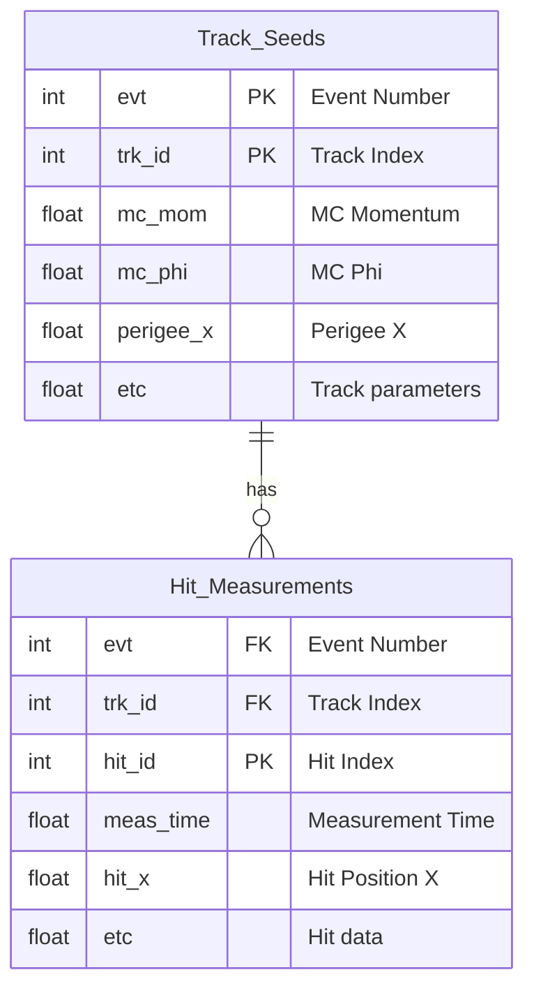

# CSV Data Format

The TDIS tracking system exports tracking data to CSV format for analysis and debugging purposes.

## Overview

- CSV files are generated with configurable prefix via `csv:prefix` parameter (default: "output")
- Two CSV files are created per run:
  - `{prefix}.in_tracks.csv` - Track seed and Monte Carlo track information
  - `{prefix}.in_hits.csv` - Hit measurements and detailed hit information
- Column names are provided in the first line (header row) of each CSV file
- All numeric values use standard scientific notation where appropriate

## File Structure

The CSV files contain related tracking information with relational links:



## Table Definitions

### in_tracks.csv

Contains track seed information with associated Monte Carlo truth data and track parameters.

**Primary Key:** Composite key of (`evt`, `trk_id`)

| Column Index | Column Name | Type | Description |
|-------------|-------------|------|-------------|
| 0 | `evt` | uint64 | Event number/index |
| 1 | `trk_id` | int | Track seed index within event |
| 2 | `mc_mom` | float | MC track total momentum [GeV/c] |
| 3 | `mc_phi` | float | MC track phi angle at start [rad] |
| 4 | `mc_theta` | float | MC track theta angle at start [rad] |
| 5 | `mc_vtx_z` | float | MC track exact Z vertex position [mm] |
| 6 | `mc_hits_count` | int | Number of MC hits for this track |
| 7 | `pdg` | int | Particle PDG code |
| 8 | `tp_phi` | float | Track parameters phi [rad] |
| 9 | `tp_theta` | float | Track parameters theta [rad] |
| 10 | `tp_time` | float | Track time [ns] |
| 11 | `qoverp` | float | Charge over momentum [c/GeV] |
| 12 | `surface` | uint64 | Surface geometry ID |
| 13 | `loc0` | float | Local position on surface coordinate 0 [mm] |
| 14 | `loc1` | float | Local position on surface coordinate 1 [mm] |
| 15 | `cov_loc0` | float | Covariance matrix element for loc0 [mm²] |
| 16 | `cov_loc1` | float | Covariance matrix element for loc1 [mm²] |
| 17 | `cov_phi` | float | Covariance matrix element for phi [rad²] |
| 18 | `cov_theta` | float | Covariance matrix element for theta [rad²] |
| 19 | `cov_qoverp` | float | Covariance matrix element for q/p [(c/GeV)²] |
| 20 | `cov_time` | float | Covariance matrix element for time [ns²] |
| 21 | `perigee_x` | float | Perigee point X coordinate [mm] |
| 22 | `perigee_y` | float | Perigee point Y coordinate [mm] |
| 23 | `perigee_z` | float | Perigee point Z coordinate [mm] |
| 24 | `fhit_id` | int | First hit index (optional) |
| 25 | `fhit_time` | float | First hit time [ns] (optional) |
| 26 | `fhit_plane` | int | First hit plane number (optional) |
| 27 | `fhit_ring` | int | First hit ring number (optional) |
| 28 | `fhit_pad` | int | First hit pad number (optional) |
| 29 | `fhit_ztogem` | float | First hit Z distance to GEM [mm] (optional) |
| 30 | `fhit_true_x` | float | First hit true X position [mm] (optional) |
| 31 | `fhit_true_y` | float | First hit true Y position [mm] (optional) |
| 32 | `fhit_true_z` | float | First hit true Z position [mm] (optional) |

**Note:** Columns 24-32 are empty if the track has no hits.

### in_hits.csv

Contains detailed hit and measurement information for each track.

**Primary Key:** Composite key of (`evt`, `trk_id`, hit sequence)

| Column Index | Column Name | Type | Description |
|-------------|-------------|------|-------------|
| 0 | `evt` | uint64 | Event number/index |
| 1 | `trk_id` | int | Track seed index (foreign key to in_tracks) |
| 2 | `meas_time` | float | Measurement time [ns] |
| 3 | `meas_surface` | uint64 | Measurement surface geometry ID |
| 4 | `meas_loc0` | float | Measurement local position coordinate 0 [mm] |
| 5 | `meas_loc1` | float | Measurement local position coordinate 1 [mm] |
| 6 | `meas_cov0` | float | Measurement covariance for loc0 [mm²] |
| 7 | `meas_cov1` | float | Measurement covariance for loc1 [mm²] |
| 8 | `meas_cov_time` | float | Measurement covariance for time [ns²] |
| 9 | `hit_id` | int | Tracker hit unique ID |
| 10 | `hit_cell_id` | uint32 | Tracker hit cell identifier |
| 11 | `hit_x` | float | Tracker hit global X position [mm] |
| 12 | `hit_y` | float | Tracker hit global Y position [mm] |
| 13 | `hit_z` | float | Tracker hit global Z position [mm] |
| 14 | `hit_time` | float | Tracker hit time [ns] |
| 15 | `hit_adc` | float | Tracker hit ADC value (energy deposit) |
| 16 | `mc_hit_id` | int | MC hit unique ID |
| 17 | `mc_hit_plane` | int | MC hit plane number |
| 18 | `mc_hit_ring` | int | MC hit ring number |
| 19 | `mc_hit_pad` | int | MC hit pad number |
| 20 | `mc_hit_time` | float | MC hit time [ns] |
| 21 | `mc_hit_adc` | float | MC hit ADC value |
| 22 | `mc_hit_ztogem` | float | MC hit Z distance to GEM [mm] |
| 23 | `mc_hit_true_x` | float | MC hit true X position [mm] |
| 24 | `mc_hit_true_y` | float | MC hit true Y position [mm] |
| 25 | `mc_hit_true_z` | float | MC hit true Z position [mm] |

## Cell ID Encoding

The `hit_cell_id` field encodes the detector geometry location as:
```
cell_id = 1000000 * plane + 1000 * ring + pad
```

## Usage Examples

### Python/Pandas

Reading the CSV files with pandas:

```python
import pandas as pd

# Read track data
tracks_df = pd.read_csv('output.in_tracks.csv')

# Read hit data
hits_df = pd.read_csv('output.in_hits.csv')

# Join tracks with their hits
tracks_with_hits = pd.merge(
    tracks_df, 
    hits_df, 
    on=['evt', 'trk_id'],
    how='left'
)

# Filter tracks by momentum
high_p_tracks = tracks_df[tracks_df['mc_mom'] > 1.0]  # > 1 GeV/c
```

### Data Analysis

Common analysis tasks:

1. **Track efficiency**: Compare number of reconstructed hits (`mc_hits_count`) with actual measurements
2. **Resolution studies**: Compare MC truth positions (`mc_hit_true_*`) with reconstructed positions (`hit_*`)
3. **Momentum analysis**: Study track parameter covariances vs. MC momentum
4. **Geometry validation**: Verify hit distributions across planes, rings, and pads

## Units

All units follow the Acts framework conventions:

- **Length**: millimeters (mm)
- **Time**: nanoseconds (ns)  
- **Momentum**: GeV/c
- **Angles**: radians
- **Charge**: elementary charge units

## Implementation

The CSV writer is implemented in:
- Source: [`source/tdis/io/CsvWriteProcessor.hpp`](https://github.com/tdis/source/tdis/io/CsvWriteProcessor.hpp)
- Factory: [`source/tdis/tracking/TruthTracksHitsSeedsFactory.cpp`](https://github.com/tdis/source/tdis/tracking/TruthTracksHitsSeedsFactory.cpp)

The writer processes `TrackSeed` objects with associated `Measurement2D` and `TrackerHit` data, extracting both reconstructed and Monte Carlo truth information.
