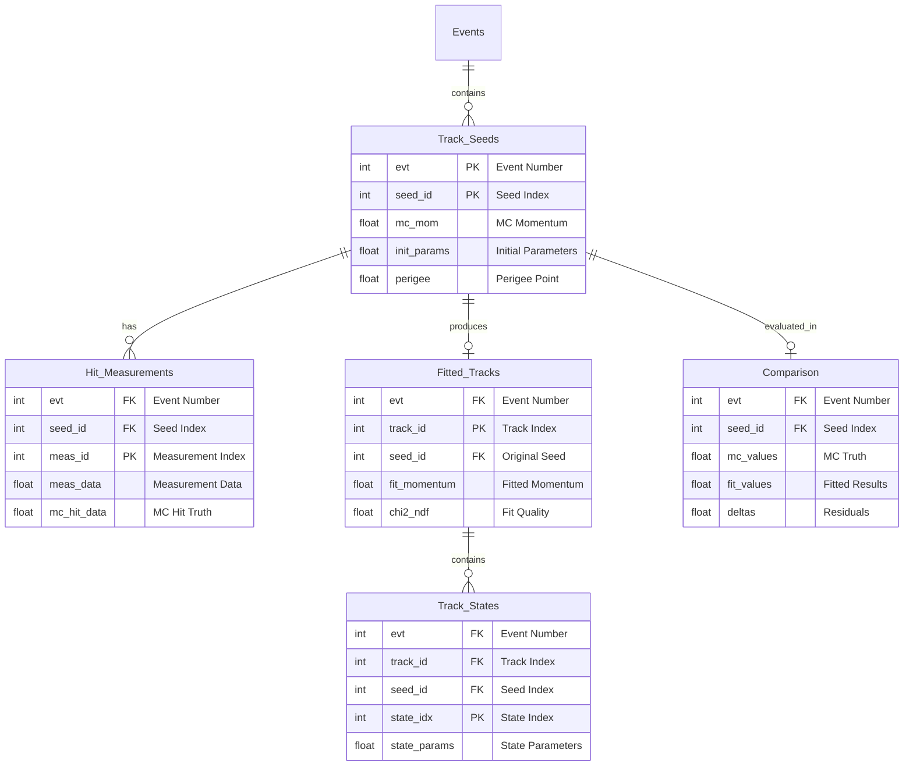

# CSV Data Format

The TDIS tracking system exports comprehensive tracking data to CSV format for analysis, debugging, and performance evaluation.

## Overview

- CSV files are generated with configurable prefix via `csv:prefix` parameter (default: "output")
- Five interconnected CSV files are created per run:
  - `{prefix}.seeds.csv` - Track seeds with Monte Carlo truth and initial parameters
  - `{prefix}.hits.csv` - Hit measurements and detailed hit information
  - `{prefix}.fitted_tracks.csv` - Fitted track results after Kalman filtering
  - `{prefix}.track_states.csv` - Detailed track states along trajectories
  - `{prefix}.comparison.csv` - Performance comparison between truth and fitted values
- Column names are provided in the first line (header row) of each CSV file
- All numeric values use standard scientific notation where appropriate
- Files are linked through common ID fields enabling full traceability

## ID Linkage Strategy

The CSV files form a relational structure with full traceability from MC truth through reconstruction:



## Table Definitions

### seeds.csv

Contains track seed information with Monte Carlo truth data and initial track parameters.

**Primary Key:** Composite key of (`evt`, `seed_id`)

| Column | Name | Type | Description |
|--------|------|------|-------------|
| 0 | `evt` | uint64 | Event number/index |
| 1 | `seed_id` | int | Track seed index within event |
| 2 | `mc_mom` | float | MC track total momentum [GeV/c] |
| 3 | `mc_phi` | float | MC track phi angle [rad] |
| 4 | `mc_theta` | float | MC track theta angle [rad] |
| 5 | `mc_vtx_z` | float | MC track Z vertex [mm] |
| 6 | `mc_hits_count` | int | Number of MC hits |
| 7 | `pdg` | int | Particle PDG code |
| 8 | `init_phi` | float | Initial parameters phi [rad] |
| 9 | `init_theta` | float | Initial parameters theta [rad] |
| 10 | `init_time` | float | Initial track time [ns] |
| 11 | `init_qoverp` | float | Initial charge/momentum [c/GeV] |
| 12 | `init_surface` | uint64 | Initial surface geometry ID |
| 13 | `init_loc0` | float | Initial local position 0 [mm] |
| 14 | `init_loc1` | float | Initial local position 1 [mm] |
| 15-20 | `cov_*` | float | Covariance matrix diagonal elements |
| 21-23 | `perigee_*` | float | Perigee point coordinates [mm] |
| 24-32 | `fhit_*` | various | First hit information (optional) |

### hits.csv

Contains measurement and hit information for each track seed.

**Primary Key:** Composite key of (`evt`, `seed_id`, `meas_id`)

| Column | Name | Type | Description |
|--------|------|------|-------------|
| 0 | `evt` | uint64 | Event number |
| 1 | `seed_id` | int | Track seed index (FK to seeds) |
| 2 | `meas_id` | int | Measurement index within track |
| 3 | `meas_time` | float | Measurement time [ns] |
| 4 | `meas_surface` | uint64 | Surface geometry ID |
| 5-6 | `meas_loc*` | float | Local position [mm] |
| 7-9 | `meas_cov*` | float | Measurement covariances |
| 10-16 | `hit_*` | various | Reconstructed hit data |
| 17-26 | `mc_hit_*` | various | MC truth hit data |

### fitted_tracks.csv

Contains fitted track results from Kalman filtering.

**Primary Key:** Composite key of (`evt`, `track_id`)  
**Foreign Key:** `seed_id` links to original seed

| Column | Name | Type | Description |
|--------|------|------|-------------|
| 0 | `evt` | uint64 | Event number |
| 1 | `track_id` | int | Fitted track unique ID |
| 2 | `seed_id` | int | Original seed ID (FK) |
| 3 | `fit_type` | int | Track type/quality flag |
| 4-6 | `fit_p*` | float | Fitted momentum components [GeV/c] |
| 7 | `fit_p` | float | Total fitted momentum [GeV/c] |
| 8 | `fit_theta` | float | Fitted theta angle [rad] |
| 9 | `fit_phi` | float | Fitted phi angle [rad] |
| 10-12 | `fit_vtx_*` | float | Fitted vertex position [mm] |
| 13 | `fit_time` | float | Fitted time [ns] |
| 14 | `fit_time_err` | float | Time uncertainty [ns] |
| 15 | `fit_charge` | float | Particle charge [e] |
| 16 | `fit_chi2` | float | Total chi-squared |
| 17 | `fit_ndf` | int | Degrees of freedom |
| 18 | `fit_chi2ndf` | float | Reduced chi-squared |
| 19 | `fit_pdg` | int | PDG hypothesis |
| 20 | `n_states` | int | Number of track states |
| 21 | `n_measurements` | int | Used measurements |
| 22 | `n_outliers` | int | Outlier count |
| 23 | `n_holes` | int | Missing hit count |

### track_states.csv

Contains track parameters at each surface along the trajectory.

**Primary Key:** Composite key of (`evt`, `track_id`, `state_idx`)

| Column | Name | Type | Description |
|--------|------|------|-------------|
| 0 | `evt` | uint64 | Event number |
| 1 | `track_id` | int | Track ID (FK) |
| 2 | `seed_id` | int | Original seed ID (FK) |
| 3 | `state_idx` | int | State index along track |
| 4 | `surface_id` | uint64 | Surface geometry ID |
| 5-6 | `loc*` | float | Local position [mm] |
| 7 | `phi` | float | Phi angle [rad] |
| 8 | `theta` | float | Theta angle [rad] |
| 9 | `qoverp` | float | Charge/momentum [c/GeV] |
| 10 | `p` | float | Momentum magnitude [GeV/c] |
| 11 | `time` | float | Time [ns] |
| 12 | `path_length` | float | Path from origin [mm] |
| 13 | `chi2` | float | State chi-squared |
| 14 | `type` | string | State type (measurement/outlier/hole) |

### comparison.csv

Side-by-side comparison of MC truth, initial, and fitted parameters.

**Primary Key:** Composite key of (`evt`, `seed_id`)

| Column | Name | Type | Description |
|--------|------|------|-------------|
| 0 | `evt` | uint64 | Event number |
| 1 | `seed_id` | int | Seed ID (FK) |
| 2-5 | `mc_*` | float | MC truth values |
| 6-8 | `init_*` | float | Initial seed parameters |
| 9-12 | `fit_*` | float | Fitted parameters |
| 13 | `fit_chi2ndf` | float | Fit quality |
| 14 | `delta_p` | float | Momentum residual [GeV/c] |
| 15 | `delta_p_rel` | float | Relative momentum residual |
| 16 | `delta_theta` | float | Theta residual [rad] |
| 17 | `delta_phi` | float | Phi residual [rad] |
| 18 | `delta_vtx_z` | float | Vertex Z residual [mm] |
| 19 | `fit_success` | int | Fit success flag (1/0) |

## Usage Examples

### Python/Pandas Analysis

```python
import pandas as pd
import numpy as np
import matplotlib.pyplot as plt

# Load all CSV files
seeds_df = pd.read_csv('output.seeds.csv')
hits_df = pd.read_csv('output.hits.csv')
tracks_df = pd.read_csv('output.fitted_tracks.csv')
states_df = pd.read_csv('output.track_states.csv')
comp_df = pd.read_csv('output.comparison.csv')

# Example 1: Track reconstruction efficiency
total_seeds = len(seeds_df)
fitted_tracks = len(tracks_df)
efficiency = fitted_tracks / total_seeds * 100
print(f"Tracking efficiency: {efficiency:.1f}%")

# Example 2: Momentum resolution study
comp_df['p_resolution'] = comp_df['delta_p_rel'] * 100  # Convert to percentage
plt.hist(comp_df['p_resolution'], bins=50, range=(-10, 10))
plt.xlabel('Momentum Resolution (%)')
plt.ylabel('Tracks')
plt.title(f'Momentum Resolution (RMS: {comp_df["p_resolution"].std():.2f}%)')

# Example 3: Chi2/ndf distribution for quality assessment
quality_tracks = tracks_df[tracks_df['fit_chi2ndf'] > 0]
plt.hist(quality_tracks['fit_chi2ndf'], bins=50, range=(0, 10))
plt.xlabel('χ²/ndf')
plt.ylabel('Tracks')
plt.axvline(x=1, color='r', linestyle='--', label='Expected')

# Example 4: Residuals per layer
residuals_by_layer = states_df.groupby('surface_id').agg({
    'chi2': 'mean',
    'state_idx': 'count'
})
print("Average chi2 per detector layer:")
print(residuals_by_layer)

# Example 5: Track parameter pulls
# Join seeds with comparison to get covariances
pulls_df = pd.merge(seeds_df, comp_df, on=['evt', 'seed_id'])
pulls_df['pull_theta'] = pulls_df['delta_theta'] / np.sqrt(pulls_df['cov_theta'])
pulls_df['pull_phi'] = pulls_df['delta_phi'] / np.sqrt(pulls_df['cov_phi'])

# Example 6: Outlier analysis
outlier_tracks = tracks_df[tracks_df['n_outliers'] > 0]
print(f"Tracks with outliers: {len(outlier_tracks)} / {len(tracks_df)}")
```


## Performance Metrics

Common analysis metrics extractable from the CSV data:

1. **Tracking Efficiency**: `fitted_tracks / total_seeds`
2. **Momentum Resolution**: Statistics of `delta_p_rel` in comparison.csv
3. **Angular Resolution**: Statistics of `delta_theta`, `delta_phi`
4. **Track Quality**: Distribution of `fit_chi2ndf`
5. **Hit Efficiency**: `n_measurements / mc_hits_count`
6. **Outlier Rate**: `n_outliers / (n_measurements + n_outliers)`
7. **Vertex Resolution**: Statistics of `delta_vtx_z`

## Units

All units follow the Acts framework conventions:

- **Length**: millimeters (mm)
- **Time**: nanoseconds (ns)
- **Momentum**: GeV/c
- **Angles**: radians
- **Charge**: elementary charge units (e)
- **Energy**: GeV

## Implementation

The enhanced CSV writer is implemented in:
- Source: [`source/tdis/io/CsvWriterProcessor.hpp`](source/tdis/io/CsvWriterProcessor.hpp)
- Track Fitting: [`source/tdis/tracking/KalmanFittingFactory.cpp`](source/tdis/tracking/KalmanFittingFactory.cpp)

The writer processes:
- Input: `TrackSeed` objects with `Measurement2D` and MC truth
- Output: `Track`, `Trajectory`, `TrackParameters` from Kalman filter
- Links all data through consistent ID relationships for full traceability